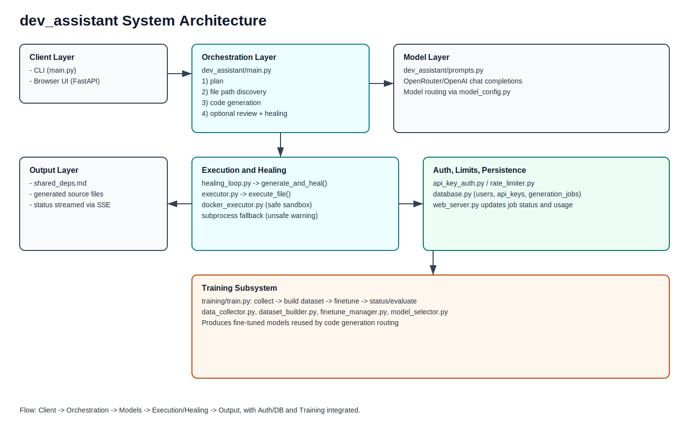
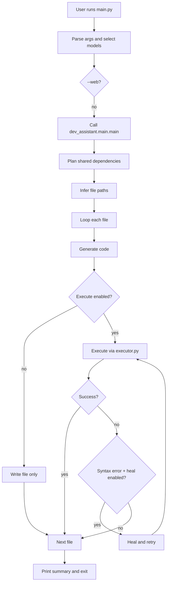
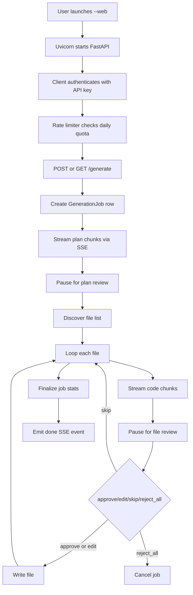
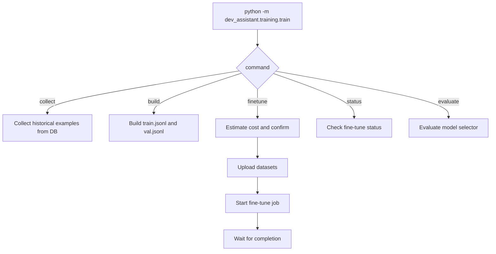

# System Architecture

## Purpose
This document describes the current architecture and execution flow of the dev_assistant project.

## High-Level Components
- Entry points
  - main.py: top-level CLI entrypoint and optional web server launcher.
  - dev_assistant/training/train.py: training and fine-tune operations.
- Core generation pipeline
  - dev_assistant/main.py: orchestrates planning, file-path discovery, code generation, review flow, and healing.
  - dev_assistant/prompts.py: model calls for plan, file path discovery, and code generation.
- Execution and healing
  - dev_assistant/executor.py: language detection and execution (Docker or subprocess).
  - dev_assistant/healing_loop.py: generate -> execute -> syntax-heal retries.
  - dev_assistant/healer.py: model-driven code repair.
- Web API and UI
  - dev_assistant/web_server.py: FastAPI app, SSE generation stream, auth endpoints, usage endpoints, review endpoints.
- Security and platform controls
  - dev_assistant/auth/api_key_auth.py: API key generation and validation.
  - dev_assistant/auth/rate_limiter.py: per-plan, per-day request limits.
  - dev_assistant/sandbox/docker_executor.py: sandboxed code execution.
  - dev_assistant/sandbox/sandbox_config.py: sandbox defaults.
- Persistence
  - dev_assistant/db/database.py: SQLAlchemy async models and DB session helpers.
- Training and model lifecycle
  - dev_assistant/training/*: data collection, dataset build, fine-tune manager, model evaluation.

## Runtime Modes
- CLI mode
  - Command path: python main.py ... without --web.
  - Uses dev_assistant/main.py for generation pipeline.
- Web mode
  - Command path: python main.py --web --host ... --port ...
  - Boots FastAPI app in dev_assistant/web_server.py.

## End-to-End Flow: CLI Mode

## End-to-End Flow: Web Mode

## Generation Pipeline Details
1. Model routing
   - main.py resolves per-step model IDs.
   - Step-specific fallback is provided by dev_assistant/model_config.py.
2. Planning step
   - plan() produces shared dependencies text.
3. File discovery step
   - specify_file_paths() returns list of target files.
4. Per-file generation
   - generate_code() creates content.
5. Optional human review
   - CLI interactive review in dev_assistant/main.py.
   - Web review workflow through ReviewManager in dev_assistant/hitl/review_manager.py.
6. Optional execution and healing
   - execute_file() runs generated code.
   - generate_and_heal() retries syntax-only failures up to max attempts.

## Sandbox and Execution Strategy
- Supported backends
  - docker: preferred when available.
  - subprocess: fallback/explicit unsafe mode.
  - auto: choose docker if available, else subprocess.
- Behavior
  - Unknown language files are skipped for execution.
  - Execution timeouts enforced.
  - Healer runs only for syntax-like errors, not dependency-missing errors.

## Auth, Quotas, and Multi-Tenancy
- API key model
  - Key format starts with dask_.
  - sha256 key hash for lookup + bcrypt secret hash for verification.
- User model
  - users table stores plan, daily counters, and active flag.
- Rate limiting
  - Applied per authenticated user using plan limits in rate_limiter.py.
  - Daily reset tracked by last_reset_date.

## Data Model (Core Tables)
- users
  - identity, auth, plan, and usage counters.
- api_keys
  - per-user key records with active flag and scopes.
- generation_jobs
  - prompt, model, status, files generated, tokens, cost, output dir, timestamps.

## Training Subsystem Flow

## Key Design Decisions
- Separation of concerns
  - CLI/web entrypoints are thin; orchestration lives in dev_assistant/main.py and web_server.py.
- Safety-first execution
  - Path traversal guards and optional containerized execution.
- Human-in-the-loop support
  - Review checkpoints are first-class in web generation stream.
- Progressive model lifecycle
  - Supports baseline model routing and fine-tuned model integration.

## Folder Responsibilities
- dev_assistant/: production pipeline and service code.
- dev_assistant/auth/: authentication and policy enforcement.
- dev_assistant/db/: persistence models and session utilities.
- dev_assistant/sandbox/: execution isolation.
- dev_assistant/hitl/: review workflow.
- dev_assistant/training/: data and fine-tune operations.
- v0/: legacy prototype scripts.

## Typical Requests and Control Paths
- Generate from CLI
  - main.py -> dev_assistant/main.py -> prompts + healing_loop + executor -> output folder.
- Generate from Web UI
  - web_server.py /generate -> prompts + review_manager + DB job tracking -> output folder.
- Manage API access
  - /auth/* -> api_key_auth.py + database.py.
- Enforce plan limits
  - Depends(rate_limit_check) on protected routes.

## Operational Notes
- On Windows, UTF-8 stdout/stderr reconfiguration is applied in current entrypoints to prevent console encoding failures.
- Default web port is 8000; startup pre-check rejects occupied port with a clear message.
- Docker availability determines whether sandbox mode can run containerized execution.
